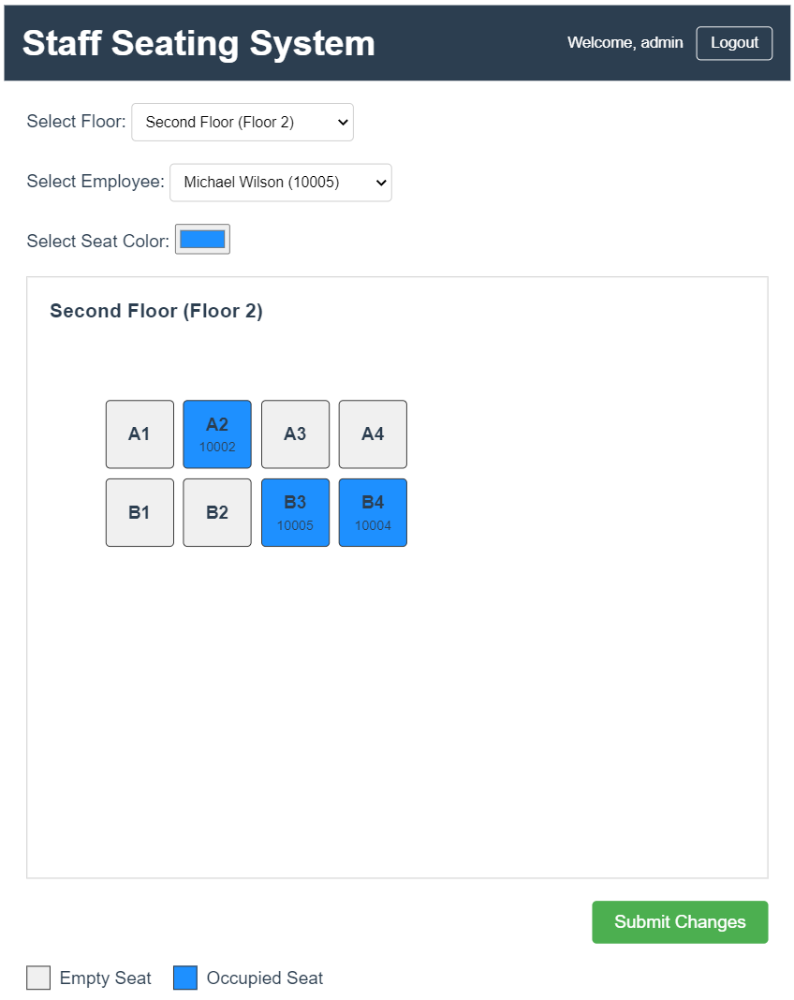

# Staff Seating System

A comprehensive web application for managing office seating arrangements within your company.

## Features

1. **Floor Plan Display**

   - Retrieves and displays seating information for each floor from the database
   - Uses different colors to indicate available seats and occupied seats (showing employee IDs)
   - Provides a visual representation of the entire office layout

2. **Seat Management**

   - Ensures each employee can only occupy one seat
   - Includes dropdown menu for employee selection (employee IDs are fixed at 5 digits)
   - Changes seat color to "selection" state after selecting an employee and clicking an empty seat
   - Allows occupied seats to be cleared and returned to available status
   - Saves seating information to the database with the "Submit" button

3. **System Architecture**

   - Implements a three-tier architecture: Web Server + Application Server + MySQL
   - Backend design includes presentation layer, business layer, data layer, and common layer

4. **Technical Specifications**
   - Frontend: Vue.js
   - Backend: Spring Boot
   - Database: MySQL relational database
   - API Design: RESTful architecture
   - Build Tool: Maven
   - Database Access: Stored Procedures
   - Data Integrity: Transaction implementation for multi-table operations
   - Security: Protection against SQL Injection and XSS attacks
   - Database Scripts: DDL and DML scripts provided in the project's DB folder

## Quick Start

### Requirements

- MySQL
- Java 21 and IntelliJ IDEA
- npm (Node Package Manager)
- Web browser

### Database Setup

1. Create a MySQL database named `seating`
2. Configure `spring.datasource.username` and `spring.datasource.password` in the `application.properties` file in the Spring Boot app according to your MySQL setup
3. Set up the database using the provided scripts:
   - Run `./DB/schema.sql` to create the database schema
   - Run `./DB/data.sql` to populate the database with sample data
   - Run `./DB/stored-procedures.sql` to create necessary MySQL functions for the backend

### Backend Server Setup

1. Open the `backend` folder with IntelliJ IDEA
2. Use Maven to download required dependencies
3. Start the server at http://localhost:8080

### Frontend Setup

1. Navigate to the `frontend` folder in your terminal
2. Run `npm i` to install required packages
3. Run `npm run dev` to start the development server at http://localhost:5173

### Authentication

Use the default credentials to log in:

- Username: `admin`
- Password: `admin`

> **Note:** The default user is automatically created in MySQL when the backend server first starts (configured in `./config/DataLoader.java`). Please disable this feature in production environments.

## Application Screenshots



## Project Structure

```
staff-seating-system/
├── backend/
│   ├── src/
│   │   ├── main/
│   │   │   ├── java/
│   │   │   │   ├── com/company/seating/
│   │   │   │   │   ├── config/
│   │   │   │   │   ├── controller/
│   │   │   │   │   ├── dto/
│   │   │   │   │   ├── exception/
│   │   │   │   │   ├── model/
│   │   │   │   │   ├── repository/
│   │   │   │   │   ├── service/
│   │   │   │   │   └── util/
│   │   │   ├── resources/
│   │   │   │   └── application.properties
│   │   └── test/
│   └── pom.xml
├── frontend/
│   ├── public/
│   ├── src/
│   │   ├── assets/
│   │   ├── components/
│   │   ├── router/
│   │   ├── services/
│   │   ├── stores/
│   │   ├── views/
│   │   ├── App.vue
│   │   └── main.js
│   ├── package.json
│   └── vite.config.js
└── DB/
├── schema.sql
├── data.sql
└── stored-procedures.sql
```

## API Documentation

The system provides the following RESTful endpoints:

- `GET /api/floors` - Retrieve all floor information
- `GET /api/employees` - Retrieve all employee information
- `GET /api/seats/floor/{floorId}` - Retrieve all seats for a specific floor
- `POST /api/seats/assign` - Assign an employee to a seat

## Security Considerations

- The application implements protection against SQL Injection attacks
- XSS prevention measures are in place for user inputs
- Authentication is required for all sensitive operations
- Transactions are implemented for data integrity

## Future Enhancements

- Add user role management
- Implement floor plan editor
- Add reporting capabilities
- Support for mobile devices

## Authors

- [@NoMercySusie](https://github.com/willychen0146)

## License

This project is licensed under the MIT License - see the LICENSE file for details.
